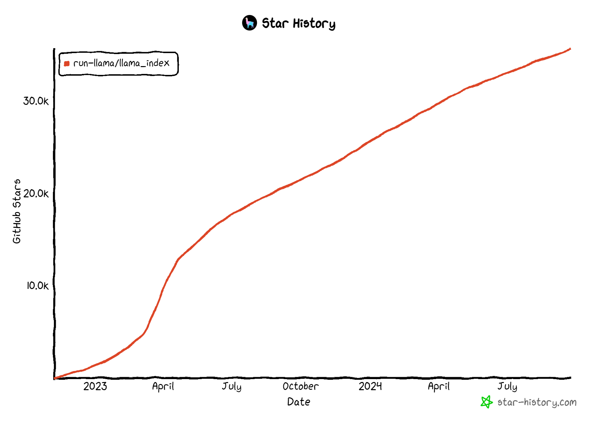

Understanding Llama-Index
=========================

1. ### Overview 

    Large Language Models (LLMs) serve as a bridge between human language and complex datasets, providing a means of interfacing with vast quantities of information. Publicly accessible pre-training has been applied to an extensive range of sources, including encyclopaedias, email archives, books, programming codes, and various other digital resources. However, there exists a significant limitation in that these models do not have direct access to proprietary or specialised data sets, such as those stored within APIs, relational databases, or even locked away in PDFs and presentation slides.

    To address this challenge, LlamaIndex offers a solution through its Retrieval Augmented Generation (RAG) capability. By integrating with diverse data sources, RAG facilitates the retrieval, transformation, and generation of novel insights from one's data. Users can pose queries regarding their data, create conversational interfaces, develop semi-autonomous agents, and explore myriad additional applications. 

    In brief, LlamaIndex is an orchestration framework that simplifies the integration of private data with public data for building applications using Large Language Models (LLMs). It provides tools for data ingestion, indexing, and querying. 

    LlamaIndex boasts around 35.6k stars on GitHub with more than 1200 contributors as of Sep’24. 

        

<em>LlamaIndex Github Stars</em>

---

2. ### Key Functionalities of LlamaIndex

    - <b> Data Ingestion:</b> LlamaIndex enables efficient ingestion of data from diverse sources, including APIs, PDFs, databases, and even popular productivity tools such as Gmail, Notion, and Airtable. This process ensures that the data is brought into the system for further processing.

    - <b> Data Structuring:</b> Once the data is ingested, LlamaIndex structures it through a series of processes, including tokenization, stemming, and lemmatization, resulting in a well-organised dataset that is easy to navigate and analyse.

    - <b> Query Retrieval:</b> The central component of LlamaIndex is its ability to retrieve specific fragments of data based on queries provided by users. This feature allows for lightning-fast responses to complex questions, streamlining the interaction between humans and machines.

    - <b> Integration Mechanisms:</b> LlamaIndex offers seamless integration with various application frameworks, enabling developers to incorporate advanced natural language abilities into their projects without extensive programming knowledge.

        

<em>Working of Llama-Index</em>

3. ### Core Elements of LlamaIndex

    At its core, LlamaIndex comprises four essential elements explained below: 

    - <b> Data Connectors: </b> These connectors serve as intermediaries between the raw data and LlamaIndex, retrieving information from disparate sources and transporting it to the system for processing.

    - <b> Data Indexes: </b> These indexes structure the incoming data according to predetermined criteria, facilitating rapid access to relevant segments during query execution.

    - <b> Engines: </b> Powered by sophisticated algorithms and machine learning techniques, engines enable the creation of highly specialised indexes tailored to individual use cases, such as vector indices, tree indices, lists, or keyword indices. Each type of index consists of nodes, representing chunks of text from original documents.

    - <b> Tailoring Index Types: </b> Depending on the requirements of each project, LlamaIndex supports the construction of different index types, including vector indexes, tree indexes, list indexes, and keyword indexes. By manipulating these nodes, developers can generate practical solutions for varied industries and applications.

---

4. ### Applications of LlamaIndex

    LlamaIndex boasts an extensive scope of applications, with particular emphasis on augmenting the capacities of Large Language Models (LLMs). A sampling of these applications includes:

    - <b> Question Answering: </b> LlamaIndex enables the extraction of information from diverse forms of unstructured content, including PDFs, presentations, websites, and images. This facilitates the development of intelligent systems capable of addressing complex queries across vast datasets.

    - <b> Enhanced Chatbots: </b> By leveraging LlamaIndex's indexing functionality, developers can create conversational agents that draw upon comprehensive knowledge bases, leading to more engaging and informative interactions between users and bots.

    - <b> Automated Decision Making: </b> The tool allows for the creation of knowledge-based automation systems, which can efficiently process tasks by integrating with existing workflows and databases.

    - <b> Structured Analytics: </b> With its ability to interact with structured data sources through natural language processing, LlamaIndex simplifies the querying and analysis of organised data within various frameworks.

    - <b> Full-Stack Web Applications: </b> Developers may utilize LlamaIndex to construct robust, full-fledged web applications, capitalizing on its capacity to handle both frontend and backend functionalities.

    - <b> Semantic Search Engines: </b> Building chatbots, semantic search engines, or question-answering systems becomes significantly easier due to LlamaIndex's extensive array of features for managing data ingestion, structure, retrieval, and integration with different software frameworks. In essence, this powerful tool can greatly enhance the performance of various applications by incorporating the potency of large language models.

---
